<!--
  ═══════════════════════════════════════════════════════════════════════
  SETUP CHECKLIST (delete this comment block once done)
  ═══════════════════════════════════════════════════════════════════════
  1. This file goes in a repo named exactly "muhathif-26" (a repo that
     matches your username) so GitHub renders it on your profile.
  2. Copy the /assets folder from this package into that repo's root.
  3. Replace every "EDIT_ME" placeholder below (LinkedIn, portfolio,
     email, X/Twitter, Discord, Instagram, demo links).
  4. For the workflows in /.github/workflows to run:
       - metrics.yml needs a repo secret METRICS_TOKEN
         (a PAT with `repo` + `read:user` scope)
       - update-readme.yml needs a repo secret GH_TOKEN (same scopes)
       - snake.yml works out of the box with the default GITHUB_TOKEN
  5. After the first snake.yml run, an "output" branch is created —
     the snake image URLs below already point to it.
  ═══════════════════════════════════════════════════════════════════════
-->

<div align="center">


<br/>

<a href="https://git.io/typing-svg">
  
</a>

<br/><br/>


<br/><br/>


<br/><br/>

<a href="https://linkedin.com/in/muhammad_muhathif" target="_blank"></a>
<a href="https://EDIT_ME-portfolio.dev" target="_blank"></a>
<a href="mailto:muhathifmuhathif26@gmail.com"></a>
<a href="https://x.com/Muhaathif_MH" target="_blank"></a>

</div>


<br/>

<table align="center" width="100%">
<tr>
<td width="42%" align="center" valign="top">



</td>
<td width="58%" valign="top">


```bash
muhathif@dev:~$ whoami
```

```yaml
Name          : Muhammed Muhathif
Role          : Software Engineer 
Focus         : Full-Stack & AI-driven Applications
Stack         : JavaScript · Python · React · Node.js
Currently     : Building production-grade booking & healthcare systems
Dream Job     : Developering role where I ship things that matter
Fun Fact      : I debug faster with coffee in hand ☕
```

Hi, I'm **Muhammed Muhathif** — a software Developer who enjoys turning
real-world problems into clean, dependable products. I care about
readable code, sensible architecture, and shipping things people
actually use. Currently sharpening my full-stack and AI Developering
skills through hands-on projects like a car rental booking platform
and a prescription management system.

</td>
</tr>
</table>


## 🖥️ &nbsp;Developer Dashboard

<div align="center">

| | |
|---|---|
| 🟢 **Status** | Available for internship / entry-level roles |
| ☕ **Coffee Level** | ████████░░ 80% |
| 🚧 **Current Project** | Car Rental Booking System |
| 📈 **Years Learning** | 2+ years |
| 📍 **Location** | Nintavur , Sri Lanka |
| 🕒 **Timezone** | Sri Lanka (GMT±5) |
| 💬 **Preferred Languages** | JavaScript, Python |
| 🎯 **Current Goal** | Land a Software Developering internship |
| 🌱 **Open Source** | Learning to contribute |

</div>


## 🧩 &nbsp;Tech Stack

<div align="center">

**Languages**
<br/>


**Frontend**
<br/>


**Backend**
<br/>


**Mobile**
<br/>


**Database**
<br/>


**Cloud**
<br/>


**DevOps**
<br/>


**AI**
<br/>


**Tools**
<br/>


**Operating Systems**
<br/>


</div>


## 📊 &nbsp;GitHub Analytics

<div align="center">


</div>


## 🏆 &nbsp;Achievements

<div align="center">


<br/>


<br/>


</div>


## 🚀 &nbsp;Featured Projects

<table align="center" width="100%">
<tr>
<td width="50%" valign="top">


### 🚗 Car Rental Booking System


A full-stack platform for browsing, booking, and managing car
rentals — covering vehicle inventory, real-time availability,
booking workflows, and an admin dashboard.

**Features**
- Real-time vehicle availability & search filters
- Secure booking flow with status tracking
- Admin dashboard for fleet & reservation management
- Responsive UI across devices

**Tech Stack**
<br/>


<br/><br/>

[](https://github.com/muhathif-26/car-rental-booking-system)
[](https://EDIT_ME.vercel.app)

</td>
<td width="50%" valign="top">


### 💊 Prescription Management System


A system for managing patient prescriptions digitally —
built to reduce manual paperwork and streamline the
prescribing and dispensing workflow.

**Features**
- Patient & prescription record management
- Role-based access for doctors / pharmacists
- Prescription history & search
- Clean, form-driven UI for fast data entry

**Tech Stack**
<br/>


<br/><br/>

[](https://github.com/muhathif-26/prescription-management-system)
[](https://EDIT_ME.vercel.app)

</td>
</tr>
</table>


## 🛤️ &nbsp;Experience Timeline

<div align="center">

```
   2023  ●  Started Programming
          │
          ▼
   2024  ●  Built Full-Stack Projects
          │
          ▼
   2025  ●  Explored AI & Applied Projects
          │
          ▼
   2026  ●  Software Developering — Career Focus
```

</div>


## 📈 &nbsp;Skills Progress

<div align="center">

`Java`      &nbsp;&nbsp;
<br/>
`Python`    &nbsp;
<br/>
`JavaScript`
<br/>
`PHP`       &nbsp;&nbsp;&nbsp;
<br/>
`React`     &nbsp;&nbsp;
<br/>
`Node.js`   &nbsp;
<br/>
`Docker`    &nbsp;
<br/>
`AWS`       &nbsp;&nbsp;
<br/>
`System Design`
<br/>
`SQL`       &nbsp;&nbsp;

<sub>Edit the numbers in the `progress-bar.dev` URLs above to match your real skill levels.</sub>

</div>


## 📜 &nbsp;Certifications

<table align="center" width="100%">
<tr>
<td align="center" width="33%">

**EDIT_ME Certification**
<br/>
<sub>Issuing Body · Year</sub>

</td>
<td align="center" width="33%">

**EDIT_ME Certification**
<br/>
<sub>Issuing Body · Year</sub>

</td>
<td align="center" width="33%">

**EDIT_ME Certification**
<br/>
<sub>Issuing Body · Year</sub>

</td>
</tr>
</table>


## 🎓 &nbsp;Education

<div align="center">

**EDIT_ME — Degree / Program**
<br/>
EDIT_ME Institution &nbsp;•&nbsp; EDIT_ME Year – Present

</div>


## 🧠 &nbsp;Coding Profiles

<div align="center">


<br/>


</div>


## ⚡ &nbsp;Recent GitHub Activity

<!--START_SECTION:activity-->
<!-- Automatically populated by .github/workflows/update-readme.yml -->
<!--END_SECTION:activity-->


## 🎧 &nbsp;Now Playing

<div align="center">

<!-- Optional: sign up at https://spotify-github-profile.vercel.app to get your own widget -->


</div>


## ✍️ &nbsp;Latest Blog Posts

<!--START_BLOG-->
- Blog auto-sync coming soon — connect an RSS feed via the
  [blog-post-workflow](https://github.com/gautamkrishnar/blog-post-workflow)
  action to populate this section automatically.
<!--END_BLOG-->


<div align="center">

### 💬


</div>


## ☕ &nbsp;Support My Work

<div align="center">

<a href="https://github.com/sponsors/muhathif-26"></a>
<a href="https://buymeacoffee.com/EDIT_ME"></a>

</div>


## 📬 &nbsp;Let's Connect

<div align="center">

<a href="https://github.com/muhathif-26"></a>
<a href="https://linkedin.com/in/EDIT_ME"></a>
<a href="https://EDIT_ME-portfolio.dev"></a>
<a href="mailto:EDIT_ME@gmail.com"></a>
<a href="https://x.com/EDIT_ME"></a>
<a href="https://discord.com/users/EDIT_ME"></a>
<a href="https://instagram.com/EDIT_ME"></a>

</div>

<br/>


<div align="center">
<sub>⭐ Thanks for visiting — feel free to explore my repositories and reach out.</sub>
</div>
